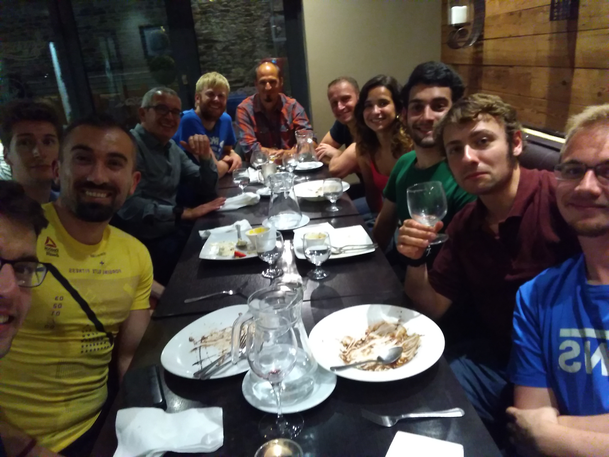

## CONNECT
CONNECT centre for future networks is an SFI funded research institution, concerned with telecommunications research.

### My contribution and network simulation
A trial by fire in C++ development, courtesy to NS-3.

### Academic retreat in Waterford
See my slides [here](pdf/waterfordDemon.pdf).

